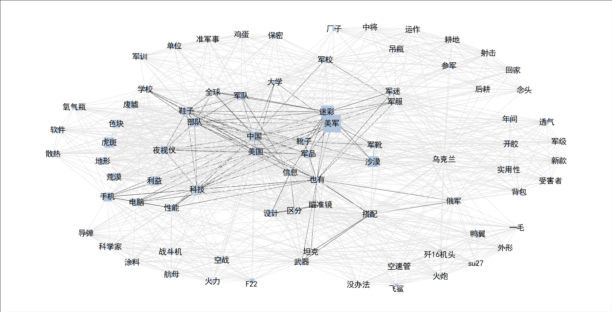

### 文本智能分析
针对群聊数据的文本分析项目

参考文章
ACL2019
https://www.aclweb.org/anthology/P19-1632.pdf


# 1.关键词集合

```
美军,51
迷彩,26
沙漠,17
虎斑,16
中国,13
利益,13
手机,12
部队,12
美国,11
科技,10
军队,10
色块,9
夜视仪,9
军品,9
电脑,8
废墟,8
地形,8
荒漠,8
设计,7
鞋子,7
军靴,5
靴子,5
也有,5
软件,5
性能,5
保密,4
科学家,4
军校,4
信息,4
散热,4
单位,4
搭配,4
氧气瓶,3
区分,3
实用性,3
涂料,3
战斗机,3
航母,3
学校,3
空战,3
俄军,3
鸭翼,3
军训,3
F22",3
开胶,3
背包,2
军迷,2
瞄准镜,2
导弹,2
空速管,2
武器,2
军服,2
新款,2
全球,2
大学,2
参军,2
透气,2
乌克兰,2
火力,2
吊瓶,2
年间,2
厂子,2
鸡蛋,1
没办法,1
准军事,1
念头,1
回家,1
射击,1
受害者,1
飞鲨",1
火炮,1
后耕,1
歼16机头",1
军级,1
坦克,1
耕地,1
su27,1
运作,1
外形,1
中将,1
一毛,1

```


# 2.社会网络图

